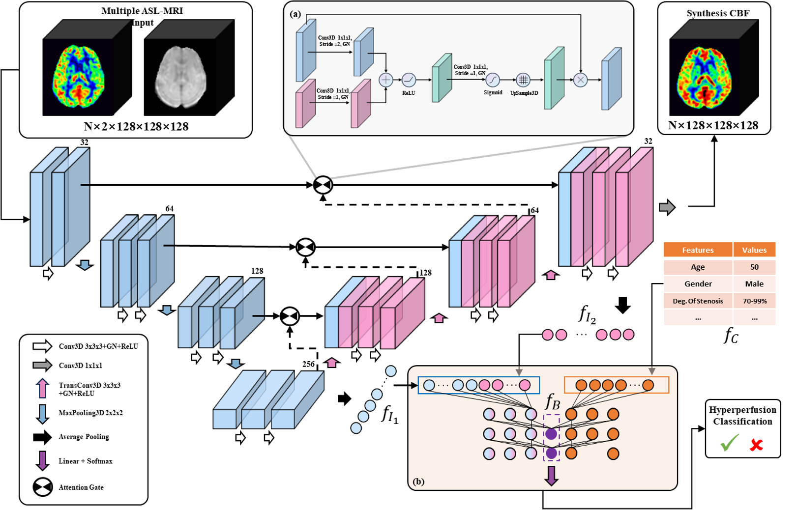

# Multitask_CH_CBF_Syn

The official implementation of our project "A Multi-task Deep Learning Network for Preoperative Prediction of Post-Carotid Endarterectomy Cerebral Hyperperfusion and Perfusion Map Synthesis“. Our work is based on Pytorch.

## Introduction
We used a multi-task architecture to generate post-CEA CBF maps simultaneous predict CH. The SSIM of CBF synthesis sub-task reaches 0.893 and AUC of  CH prediction sub-task reaches 0.933.

## Method

We use 3D Attention U-Net as our backbone to synthetis CBF maps. With the help of multi-task paradigm and multi-modal feature fusion, a classification head was added to predict CH by clincal and image features.

## Results

<!-- 

 -->

## Reference

- [MTA-Net](https://github.com/yatingling/MTANet): Multi-Task Attention Network for Automatic Medical Image Segmentation and Classification.
- [Pytorch-3dunet](https://github.com/wolny/pytorch-3dunet): PyTorch implementation of 3D U-Net and its variants.
- [3D_Attention_Unet](https://github.com/mobarakol/3D_Attention_UNet)： A implementation of 3D Attention Unet.
- [SC-GAN](https://github.com/haoyulance/sc-gan): 3D self-attention conditional GAN with spectral normalization for multi-modal neuroimaging synthesis.
- [MRI2PET](https://www.sciencedirect.com/science/article/abs/pii/S1361841523003328): Hussein, Ramy et al. “Turning brain MRI into diagnostic PET: 15O-water PET CBF synthesis from multi-contrast MRI via attention-based encoder-decoder networks.” Medical image analysis vol. 93 (2024): 103072. doi:10.1016/j.media.2023.103072.
- [Multi-task U-Net](https://github.com/hz-zhu/MT-UNet):Multi-task UNet: Jointly Boosting Saliency Prediction and Disease Classification on Chest X-ray Images", Hongzhi Zhu et al., submitted to Medical Imaging with Deep learning (MIDL) 2022.